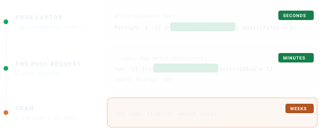

# checktor in Continuous Integration

You already run `checktor` on your package. The trouble with running it
by hand is that you do it when you remember to, which is not the same as
every time it matters. A pipeline has no such lapses, running the check
on every push, for every contributor, whether or not anyone remembered
to.

Moving the check into continuous integration (CI) turns a good habit
into an unconditional one, in about as many lines of YAML as it takes to
describe.

## The one function CI needs

Everything in this article rests on a single function.
[`checkup()`](https://r-pkg.thecoatlessprofessor.com/checktor/reference/checkup.md)
runs the full diagnosis and collapses it to one verdict: `TRUE` if the
package is clean, `FALSE` if anything wants attention.

``` r

# A throwaway package that deliberately uses T/F instead of TRUE/FALSE
bad_pkg <- example_diagnose_scenario("code_examples/tf_usage_bad.R",
                                     show_content = FALSE)

checkup(bad_pkg)
#> [1] FALSE
```

A healthy package returns `TRUE`. That is the entire contract, and it is
all a build needs to decide whether to go green or red.

## A GitHub Actions job

[`checkup()`](https://r-pkg.thecoatlessprofessor.com/checktor/reference/checkup.md)
is designed to be the last word in a shell one-liner. Drop this file in
at `.github/workflows/checktor.yaml` and you have an extra-CRAN gate on
every push and pull request:

``` yaml
name: checktor

on:
  push:
    branches: [main, master]
  pull_request:

jobs:
  checktor:
    runs-on: ubuntu-latest
    steps:
      - uses: actions/checkout@v7

      - uses: r-lib/actions/setup-r@v2
        with:
          use-public-rspm: true

      - uses: r-lib/actions/setup-r-dependencies@v2
        with:
          extra-packages: coatless-rpkg/checktor

      - name: Run extra-CRAN checks
        run: if (!checktor::checkup()) quit(status = 1)
        shell: Rscript {0}
```

The job checks out your package, installs `checktor`, and exits non-zero
the moment
[`checkup()`](https://r-pkg.thecoatlessprofessor.com/checktor/reference/checkup.md)
disagrees with you.

> **Once `checktor` is on CRAN**, swap the `extra-packages:` line for
> `any::checktor`, which needs no GitHub remote.

## Failing loudly, not silently

A red X that says only “exit code 1” is a riddle, not a report. When a
build fails, you want the diagnosis in the log, not a scavenger hunt.
Run the full
[`checktor()`](https://r-pkg.thecoatlessprofessor.com/checktor/reference/checktor.md)
once and print the report before you quit:

``` r

results <- checktor::checktor()

if (!checktor::is_healthy(results)) {
  writeLines(checktor::health_report(results))  # the diagnosis, in the log
  quit(status = 1)                              # then fail the build
}
```

[`health_report()`](https://r-pkg.thecoatlessprofessor.com/checktor/reference/health_report.md)
returns the findings as Markdown, so the failing log reads like a chart
at the foot of a hospital bed, showing what is wrong and where. Point
its `file =` argument at a path and you can just as easily upload the
report as a build artifact for the squeamish who prefer not to read CI
logs.

## Tuning the examination

CI is chatty by nature, so quiet the doctor down.
[`configure_doctor()`](https://r-pkg.thecoatlessprofessor.com/checktor/reference/configure_doctor.md)
sets the verbosity and progress defaults once, at the top of a script,
and every later call inherits them:

``` r

checktor::configure_doctor(verbose_default = FALSE, progress_default = FALSE)
```

You can also run a single category when that is all you care about,
since each `diagnose_*_issues()` function stands on its own, and a
single check the same way through its `lab_*()` function:

``` r

# Gate only on DESCRIPTION-field problems
desc <- checktor::diagnose_description_issues(".")

# Or one check on its own
tf <- checktor::lab_tf_usage(".")
```

## Findings on the diff, not in the log

A log someone has to scroll is the weakest way to deliver a finding.
Every forge can put one next to the line that caused it, and
[`ci_report()`](https://r-pkg.thecoatlessprofessor.com/checktor/reference/ci_report.md)
writes whichever shape yours reads. With no arguments it examines the
package, works out where it is running, and emits the right thing.

``` r

checktor::ci_report()
```

On GitHub Actions that prints workflow commands, and each finding
appears on the pull request diff:

    ::error file=R/plot.R,line=42,title=checktor: option_changes::Option changes check: plot.R:42

Gitea and Forgejo Actions read the same commands, so the same call
covers them. Elsewhere, name the format and the file your configuration
expects:

| Forge | Format | What to do with it |
|----|----|----|
| GitHub, Gitea, Forgejo | `"github"` | Printed to the log, shown on the diff |
| GitLab | `"gitlab"` | Name it in `artifacts:reports:codequality:` |
| Azure Pipelines | `"azure"` | Printed to the log |
| Jenkins, reviewdog, review bots | `"checkstyle"` | Read the XML with the warnings plugin |
| GitHub code scanning | `"sarif"` | Upload with `github/codeql-action/upload-sarif` |

A GitLab job needs only this:

``` yaml
checktor:
  image: rocker/r-ver:latest
  script:
    - Rscript -e 'install.packages("checktor"); checktor::ci_report(format = "gitlab")'
  artifacts:
    reports:
      codequality: gl-code-quality-report.json
```

[`ci_report()`](https://r-pkg.thecoatlessprofessor.com/checktor/reference/ci_report.md)
reports every tier, since an annotation is information rather than a
verdict. Keep
[`checkup()`](https://r-pkg.thecoatlessprofessor.com/checktor/reference/checkup.md)
for the verdict, so what fails a build stays a separate decision from
what gets pointed at. If you want an opinion to fail a build, that is
`checkup(severity = SEVERITY_LEVELS)`, and the threshold stays in one
place rather than being spelled two ways that can disagree.

Checks that did not run are named once at the end, rather than one
annotation each, because a check that never happened should not compete
for space with a finding:

    ::notice title=checktor: skipped::2 checks did not run: spelling, url_liveness

For the report formats that note goes to the job log instead, keeping
the artifact a clean document. Pass `skipped = FALSE` if you would
rather not hear about it.

## Keeping the report

[`health_report()`](https://r-pkg.thecoatlessprofessor.com/checktor/reference/health_report.md)
writes the whole consultation to a file, which an artifact step can keep
for later:

``` yaml
      - name: Upload checktor report
        if: always()
        uses: actions/upload-artifact@v7
        with:
          name: checktor-report
          path: checktor-report.md
```

Writing the report before the gate runs, and uploading it with
`if: always()`, means a failing build still leaves the findings behind
after its log has scrolled away. checktor’s own workflow does exactly
this.

## What a runner does not check

Two checks sit out in CI, because the result would say more about the
runner than about your package. The URL fetch waits until you are at the
console, and spelling waits until a spell-check backend is installed.
Neither is reported as a pass. They come back marked skipped, they are
named in `metadata$skipped_checks`,
[`tidy()`](https://generics.r-lib.org/reference/tidy.html) carries a
`skipped` column, and
[`ci_report()`](https://r-pkg.thecoatlessprofessor.com/checktor/reference/ci_report.md)
says so on the build itself, so a green build never implies a check that
never happened.

Turn the URL fetch on in a job that should do it, keeping in mind that a
network hiccup then becomes a red build:

``` r

options(checktor.url_check = TRUE)
```

## Closer to the keyboard

CI is the backstop, not the first line. If you would rather hear about a
problem before it reaches a pull request, the same one-liner works as a
local Git pre-commit hook:

``` bash
# .git/hooks/pre-commit  (make it executable: chmod +x)
#!/usr/bin/env bash
Rscript -e 'if (!checktor::checkup()) quit(status = 1)'
```

Now a commit that would have embarrassed you on CRAN never leaves your
laptop.

It is the same call in both places, and the only thing that changes is
how long you wait to hear about it.



## The takeaway

Wire
[`checkup()`](https://r-pkg.thecoatlessprofessor.com/checktor/reference/checkup.md)
into CI once and the rules stop living in your head, where they were
never safe anyway. The best submission is the one where the reviewer
finds nothing to say, and the surest way there is to have already said
it to yourself, automatically, on every push.

## See also

- [Getting Started with
  checktor](https://r-pkg.thecoatlessprofessor.com/checktor/articles/getting-started-with-checktor.md):
  the guided tour of the diagnostics.
- [Writing Your Own
  Checks](https://r-pkg.thecoatlessprofessor.com/checktor/articles/writing-checks.md):
  add project-specific checks against the parsed syntax tree.
