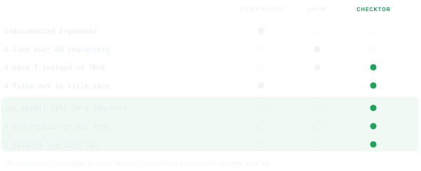
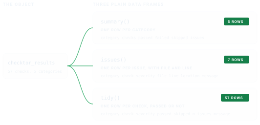

# Getting Started with checktor

## The gap checktor fills

`R CMD check` answers one question well, whether this package builds and
runs. The question that actually decides your submission goes unasked.
Will a CRAN volunteer, reading by hand, send it back? Those are
different questions, and the space between them is where afternoons
disappear. A missing `\value{}` tag. A
[`set.seed()`](https://rdrr.io/r/base/Random.html) left inside a
function. A Description that never grew past one line. Nothing in the
standard toolchain says a word about any of them.



`checktor` is the specialist your build refers you to before that
appointment. It runs the extra-CRAN checks that live in the Repository
Policy and reviewers’ long memories but nowhere in the standard
toolchain, and, true to the name, it gives you a checkup, a diagnosis,
and a prescription.

## Installation

`checktor` is on CRAN, so you can install it the usual way.

``` r

install.packages("checktor")
```

If you want the cutting-edge development version, with the latest
changes before they reach CRAN, install it from GitHub.

``` r

# install.packages("pak")
pak::pak("coatless-rpkg/checktor")
```

## A first checkup

Load the package first.

``` r

library(checktor)
```

That brings
[`checktor()`](https://r-pkg.thecoatlessprofessor.com/checktor/reference/checktor.md)
and its helpers into your session, so from here everything is a single
function call, and the natural place to begin is a checkup.

[`checktor()`](https://r-pkg.thecoatlessprofessor.com/checktor/reference/checktor.md)
examines a package directory. So we can watch it work without maiming
your own package, we will point it at a throwaway package built around
one deliberately bad file.

``` r

pkg <- example_diagnose_scenario("code_examples/tf_usage_bad.R",
                                 show_content = FALSE)
```

Here is the file it was built around, bad habits and all.

``` r

# Example file showing T/F usage issues

#' Process Data Function
#' @param data A data frame
#' @return Logical indicating success
process_data <- function(data) {
  if (is.null(data)) {
    return(F) # Issue: should be FALSE
  }

  has_complete_cases <- T # Issue: should be TRUE

  if (has_complete_cases) {
    cleaned_data <- data[complete.cases(data), ]
    return(T) # Issue: should be TRUE
  }

  return(F) # Issue: should be FALSE
}

# Another function with T/F issues
validate_input <- function(x, strict = T) {
  # Issue: should be TRUE
  if (length(x) == 0) {
    return(F)
  } # Issue: should be FALSE

  valid <- all(is.numeric(x))
  return(valid && strict == T) # Issue: should be TRUE
}
```

> Left to itself,
> [`example_diagnose_scenario()`](https://r-pkg.thecoatlessprofessor.com/checktor/reference/example_diagnose_scenario.md)
> prints that file for you, because `show_content` defaults to `TRUE`.
> We pass `FALSE` and render it above instead, so it arrives as
> highlighted R rather than console output.

Now the checkup itself.

``` r

# verbose and progress are off here, which keeps the printout compact
results <- checktor(pkg, verbose = FALSE, progress = FALSE)
results
#> ── Package Doctor - Diagnosis Summary ──────────────────────────────────────────
#> Patient: examplepackage
#> Examined: 2026-09-28 22:25:45.963769
#> Doctor version: 0.2.0
#> 
#> CODE ISSUES: 1 failing check
#> DESCRIPTION ISSUES: HEALTHY
#> DOCUMENTATION ISSUES: HEALTHY
#> GENERAL ISSUES: HEALTHY
#> POLICY ISSUES: HEALTHY
#> 
#> ℹ 2 checks did not run: "spelling" and "url_liveness".
#> ! Overall health: NEEDS ATTENTION (7 issues)
#> Run `summary()`, `issues()`, or `prescribe()` for details
```

That bedside summary names which of the five categories (code,
DESCRIPTION, documentation, general, and CRAN policy) need attention,
and gives an overall verdict. For the full catalogue of what each
category checks, see the [function
reference](https://r-pkg.thecoatlessprofessor.com/checktor/reference/index.html).

> **On your own package**, the call is simply
> [`checktor()`](https://r-pkg.thecoatlessprofessor.com/checktor/reference/checktor.md).
> It works from anywhere inside the package, so calling it with your
> working directory in `R/` or `tests/testthat/` still examines the
> whole package.

## Reading the results as data

The printed report is for humans. When you want to *compute* on the
findings, filter them, count them, fold them into a report of your own,
reach for the accessors. They return plain data frames, so you never
spelunk through nested lists.



``` r

summary(results)   # one row per category
#>        category checks passed failed skipped issues
#> 1          code     16     15      1       0      7
#> 2   description     23     22      0       1      0
#> 3 documentation     17     17      0       0      0
#> 4       general      7      6      0       1      0
#> 5        policy      4      4      0       0      0
```

``` r

issues(results)    # one row per issue, with file and line
#>   category    check   severity           file line          location
#> 1     code tf_usage robustness tf_usage_bad.R    8  tf_usage_bad.R:8
#> 2     code tf_usage robustness tf_usage_bad.R   11 tf_usage_bad.R:11
#> 3     code tf_usage robustness tf_usage_bad.R   15 tf_usage_bad.R:15
#> 4     code tf_usage robustness tf_usage_bad.R   18 tf_usage_bad.R:18
#> 5     code tf_usage robustness tf_usage_bad.R   22 tf_usage_bad.R:22
#> 6     code tf_usage robustness tf_usage_bad.R   25 tf_usage_bad.R:25
#> 7     code tf_usage robustness tf_usage_bad.R   29 tf_usage_bad.R:29
#>           message
#> 1 T/F usage check
#> 2 T/F usage check
#> 3 T/F usage check
#> 4 T/F usage check
#> 5 T/F usage check
#> 6 T/F usage check
#> 7 T/F usage check
```

`tidy(results)` gives one row per check, passed or not, and
[`as.data.frame()`](https://rdrr.io/r/base/as.data.frame.html) is its
alias. Its `skipped` column marks any check that did not run, such as
the URL fetch when you are not at the console, so a check that sat out
never reads as one that passed.
[`summary()`](https://rdrr.io/r/base/summary.html) counts such a check
under `skipped`, so `passed`, `failed` and `skipped` add up to `checks`.
Three helpers answer the common questions directly:

``` r

is_healthy(results)
#> [1] FALSE
n_issues(results)
#> [1] 7
failed_checks(results)
#> [1] "code.tf_usage"
```

[`is_healthy()`](https://r-pkg.thecoatlessprofessor.com/checktor/reference/predicates.md)
and
[`n_issues()`](https://r-pkg.thecoatlessprofessor.com/checktor/reference/predicates.md)
follow the verdict, counting only the policy and robustness tiers, while
[`issues()`](https://r-pkg.thecoatlessprofessor.com/checktor/reference/issues.md)
and
[`failed_checks()`](https://r-pkg.thecoatlessprofessor.com/checktor/reference/predicates.md)
list every tier, opinion included. Each accessor also works on a single
category, as in `issues(results$code_issues)`, or on a single check.

## The one-line gate

For scripts and pre-submission checklists,
[`checkup()`](https://r-pkg.thecoatlessprofessor.com/checktor/reference/checkup.md)
collapses the whole diagnosis to a single verdict, `TRUE` when the
package is clean:

``` r

checkup(pkg)
#> [1] FALSE
```

Built to be the last word in a shell one-liner, it takes charge of a
GitHub Actions build in the [checktor in Continuous
Integration](https://r-pkg.thecoatlessprofessor.com/checktor/articles/checktor-in-ci.md)
vignette.

## From diagnosis to treatment

A diagnosis you cannot act on is just bad news.
[`prescribe()`](https://r-pkg.thecoatlessprofessor.com/checktor/reference/prescribe.md)
turns each finding into a concrete remedy, with the before and after
spelled out.

``` r

prescribe(results)
#> ── Treatment Recommendations ───────────────────────────────────────────────────
#> 
#> ── T/F Usage Issues
#> Issues found:
#> • tf_usage_bad.R:8
#> • tf_usage_bad.R:11
#> • tf_usage_bad.R:15
#> • tf_usage_bad.R:18
#> • tf_usage_bad.R:22
#> ... and 2 more
#> Treatment: Replace `T` with `TRUE` and `F` with `FALSE`
#> # Before
#> result <- T
#> # After
#> result <- TRUE
#> 
```

[`health_report()`](https://r-pkg.thecoatlessprofessor.com/checktor/reference/health_report.md)
writes the whole consultation to a file, as Markdown, HTML, or plain
text, to keep alongside your `cran-comments.md`:

``` r

health_report(results, file = "package-health.md")
health_report(results, file = "package-health.html", format = "html")
```

## Examining one system at a time

Each category runs on its own, which helps when you are fixing one thing
and would rather not hear about the others:

``` r

diagnose_code_issues()           # just the R sources
diagnose_description_issues()    # just DESCRIPTION
diagnose_documentation_issues()  # help pages, examples, vignettes, demos
diagnose_general_issues()        # size, URLs, NEWS, README links
diagnose_policy_violations()     # CRAN policy
```

## Checking only what is included

`R CMD build` drops whatever `.Rbuildignore` matches, and checktor drops
the same files. A help topic or vignette held back from the tarball is
never checked.

The [devtag](https://github.com/moodymudskipper/devtag) package uses
this to document unexported functions: `@dev` writes the help page and
adds the `.Rd` to `.Rbuildignore`, so contributors see it and users do
not. Those examples can call `:::` and checktor will not object. The
pkgdown-only articles `usethis::use_article()` writes to
`vignettes/articles/` work the same way.

`roxygen_usage` is the exception. It reads all of `man/`, since it asks
whether your working tree is in sync with roxygen rather than what is
included.

## Turning down the volume

[`checktor()`](https://r-pkg.thecoatlessprofessor.com/checktor/reference/checktor.md)
is chatty by design. In a script, quiet it once and every later call
inherits the setting:

``` r

configure_doctor(verbose_default = FALSE, progress_default = FALSE)

# or per call
results <- checktor(verbose = FALSE, progress = FALSE)
```

## Checks you ask for, and checks you turn off

A few checks never join a run, because no authority backs them or they
ask about your submission workflow rather than the package itself. They
are not skipped, since nothing tried to run them. A quiet run does not
mention them, but the results name them:

``` r

results$metadata$on_request_checks
#> [1] "cph_role"                    "cran_comments_file"         
#> [3] "description_function_quotes" "format_names"               
#> [5] "title_starts_with_article"
```

Each one is a `lab_*()` function like any other check, so running it is
one call:

``` r

lab_cran_comments_file(pkg, verbose = FALSE)
#> ✔ cran-comments file check: PASSED
```

Going the other way, a check you have decided against can be turned off.
For one package, name it in that package’s `DESCRIPTION`:

    Config/checktor/disable: news_file

For every package, set the option once, for example in `.Rprofile`:

``` r

options(checktor.disable = "news_file")
```

A disabled check does not run and is not counted anywhere. That is the
difference from a skipped check, which was meant to run and could not.

## Where it fits

Run `checktor` in the gap between writing code and `R CMD check`:

``` r

devtools::document()
devtools::test()

results <- checktor()  # the extra-CRAN checkup
prescribe(results)     # read the remedies

devtools::check()      # the standard checks
```

## Conclusion

`checktor` is a checkup, not a cure-all. It complements `R CMD check`
and [`lintr`](https://lintr.r-lib.org) rather than replacing either, and
it cannot replace your judgment about whether a package is worth
submitting. What it does do is the one thing those tools do not,
remembering the hand-enforced CRAN rules so you do not have to. Run the
three together, treat the printed report as the conversation and the
accessors as the data, and a reviewer should find nothing left to say.
That is the entire point.

## See also

- [Where the Checks Come
  From](https://r-pkg.thecoatlessprofessor.com/checktor/articles/check-sources.md):
  the source and severity tier behind every check, from CRAN policy to
  convention.
- [What R CMD check
  Checks](https://r-pkg.thecoatlessprofessor.com/checktor/articles/r-cmd-check.md):
  every step `R CMD check` takes, so you can see where checktor begins.
- [checktor in Continuous
  Integration](https://r-pkg.thecoatlessprofessor.com/checktor/articles/checktor-in-ci.md):
  put
  [`checkup()`](https://r-pkg.thecoatlessprofessor.com/checktor/reference/checkup.md)
  in charge of a GitHub Actions build as a quality gate.
- [Writing Your Own
  Checks](https://r-pkg.thecoatlessprofessor.com/checktor/articles/writing-checks.md):
  add project-specific checks against the parsed syntax tree.
- [Function
  reference](https://r-pkg.thecoatlessprofessor.com/checktor/reference/index.html):
  the full catalogue of diagnostics.
