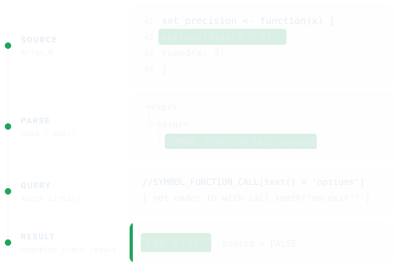
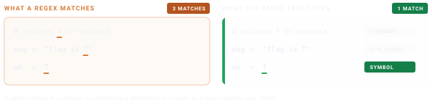

# Writing Your Own Checks

`checktor` ships more than forty diagnostics, but every team has house
rules too local to upstream: a function you have banned, a header you
insist on, a habit you keep relapsing into. This vignette is for those.
It walks through the handful of helpers in `R/ast.R` and shows how to
author a new check against the parsed syntax tree in a few lines of
XPath, with the orchestrator handling the bookkeeping.

Every check walks the same road. Your sources are parsed once into a
syntax tree, an XPath query picks out the nodes you object to, and each
match comes back as a `file:line` string inside a result that knows how
to print itself. The figure traces that road for a check that ships in
the box, the one that flags an
[`options()`](https://rdrr.io/r/base/options.html) call whose enclosing
function never puts the setting back.



## The shape of a check

Every diagnostic function follows the same contract:

``` r
diagnose_<name> <- function(path, verbose = TRUE, parsed = NULL) {
  if (is.null(parsed)) parsed <- read_r_xml(path)
  if (length(parsed) == 0L) {
    return(checktor_check_result(TRUE, character(0), "<message>"))
  }
  # ... XPath logic ...
  checktor_check_result(passed, issues, "<message>")
}
```

> **Why the `parsed` argument?** It holds an optional parse-cache, so
> when
> [`checktor()`](https://r-pkg.thecoatlessprofessor.com/checktor/reference/checktor.md)
> runs all code-side checks together, it parses each file once and hands
> the cache to every check. Fifteen code-side checks against a 200-file
> package then mean 200 parses rather than 3,000.

## Helpers in `R/ast.R`

`R/ast.R` collects the shared machinery, and a check leans on the
handful below in roughly the order of the road above.
[`read_r_xml()`](https://r-pkg.thecoatlessprofessor.com/checktor/reference/read_r_xml.md)
does the parsing and
[`xpath_lints()`](https://r-pkg.thecoatlessprofessor.com/checktor/reference/xpath_lints.md)
does the querying, so between them they carry every check in the
package. The rest are shorthands for patterns common enough to have
earned a name. Learn the first two and you can already write a check.

### `read_r_xml(path)`

This is what makes your sources queryable. It parses every `R/*.R` file
in the package and returns a named list of `list(file, xml, error)`. A
parse failure becomes an `error` slot instead of crashing the run.

``` r

parsed <- read_r_xml(".")
str(parsed[[1]])
#> List of 3
#>  $ file : chr "R/foo.R"
#>  $ xml  : xml_document
#>  $ error: NULL
```

The `xml` slot is an `xml2` document produced by
[`xmlparsedata::xml_parse_data()`](https://rdrr.io/pkg/xmlparsedata/man/xml_parse_data.html).
Every parse-tree token is an XML element with `line1`, `col1`, `line2`,
`col2` attributes.

### `xpath_lints(parsed, xpath, label = NULL)`

The workhorse. Give it an XPath query, get back `"basename:line"`
strings for every match across every file, ready to hand to a check
result’s `$issues`. The optional `label` appears in parens after each
hit.

``` r

hits <- xpath_lints(parsed,
                    "//SYMBOL_FUNCTION_CALL[text() = 'set.seed']")
#> "foo.R:42" "bar.R:17"
```

### `undesirable_function_check(parsed, funs, label = TRUE)`

The most common pattern, “flag any call to function X”, has a canned
helper:

``` r

issues <- undesirable_function_check(parsed,
                                     c("install.packages", "browser"))
```

This is `checktor`’s equivalent of
`lintr::undesirable_function_linter()`.

### `not_under_fn_with_call_xpath(funs)`

Returns an XPath predicate that restricts hits to nodes whose
*innermost* enclosing function-body doesn’t also contain a call to any
of `funs`. This is how `option_changes` enforces that
[`options()`](https://rdrr.io/r/base/options.html) is guarded by a
sibling [`on.exit()`](https://rdrr.io/r/base/on.exit.html) in the same
function, and the “innermost” part is what makes it correct on nested
functions where `on.exit` in the outer function wouldn’t cover an inner
one.

``` r

predicate <- not_under_fn_with_call_xpath(c("on.exit", "local_options"))
xpath <- paste0(
  "//SYMBOL_FUNCTION_CALL[text() = 'options']",
  "[", predicate, "]"
)
```

### `extract_rd_section(rd, tag)` and `collect_rd_text(node, skip)`

Walking `.Rd` files structurally via
[`tools::parse_Rd()`](https://rdrr.io/r/tools/parse_Rd.html):

``` r

rd <- tools::parse_Rd("man/my_fn.Rd")
ex <- extract_rd_section(rd, "\\examples")
collect_rd_text(ex, skip = "\\dontrun")
```

## Walked example: `Sys.setenv()` without cleanup

Suppose we want a check that flags any
[`Sys.setenv()`](https://rdrr.io/r/base/Sys.setenv.html) call whose
enclosing function doesn’t also call `on.exit(Sys.unsetenv(...))` or
[`withr::local_envvar()`](https://withr.r-lib.org/reference/with_envvar.html).
This is the same shape as `diagnose_option_changes` and ships in
checktor as `diagnose_sys_setenv_no_reset`. Here is the essential shape:

``` r

diagnose_sys_setenv_no_reset <- function(path, verbose = TRUE,
                                         parsed = NULL) {
  # reuse the parse-cache when checktor() supplies one, else parse fresh
  if (is.null(parsed)) parsed <- read_r_xml(path)
  if (length(parsed) == 0L) {
    return(checktor_check_result(TRUE, character(0),
                                 "Sys.setenv reset check"))
  }
  xpath <- paste0(
    "//SYMBOL_FUNCTION_CALL[text() = 'Sys.setenv'][",
    # keep only calls whose enclosing function never resets the variable
    "  ", not_under_fn_with_call_xpath(c(
        "on.exit",
        "Sys.unsetenv",
        "local_envvar", "with_envvar"
      )),
    "]"
  )
  issues <- xpath_lints(parsed, xpath)
  passed <- length(issues) == 0L
  # a shipped check also calls emit_issue_summary(issues, verbose, ...) here
  # to print the cli summary when verbose = TRUE
  checktor_check_result(passed, issues, "Sys.setenv reset check")
}
```

Twenty lines, and the interesting one is the XPath predicate. Everything
else is bookkeeping shared with every other check. The version that
ships adds one refinement, exempting a setter that captures the old
value and hands it back
(`old <- get_env(); Sys.setenv(...); invisible(old)`), since that is a
restore contract rather than a leak. Refinements like that are where a
real check earns its keep, but the skeleton is exactly this.

## The xmlparsedata XML structure

A call `fn(a, b = 1)` parses to:

``` xml
<expr>                              <!-- call expr -->
  <expr>                            <!-- function-name expr -->
    <SYMBOL_FUNCTION_CALL>fn</SYMBOL_FUNCTION_CALL>
  </expr>
  <OP-LEFT-PAREN>(
  <expr><SYMBOL>a</SYMBOL></expr>   <!-- first positional arg -->
  <OP-COMMA>,
  <SYMBOL_SUB>b</SYMBOL_SUB>        <!-- named-arg name -->
  <EQ_SUB>=</EQ_SUB>
  <expr><NUM_CONST>1</NUM_CONST></expr>  <!-- named-arg value -->
  <OP-RIGHT-PAREN>)
</expr>
```

Anchor on the `SYMBOL_FUNCTION_CALL` and every other node is one axis
away. The amber card is the one that catches people out.

![The parse tree for fn(a, b = 1). Anchored on the SYMBOL_FUNCTION_CALL
node, parent::expr reaches only the function-name wrapper, which is the
trap. The call expr is parent::expr/parent::expr, and the first
positional argument is
parent::expr/following-sibling::expr\[1\].](figures/xpath-axes-light.svg)

- the call expr is `parent::expr/parent::expr`
- the first argument expr is `parent::expr/following-sibling::expr[1]`
- a named-arg name is `parent::expr/parent::expr/SYMBOL_SUB`

That middle one is the first *argument*, not the first *positional*
argument. For `fn(b = 1, a)` the same axis lands on the value `1`, so
reach for it only when you already know the shape of the call.

## Trying it out

``` r

# Parse a file
parsed <- read_r_xml("path/to/package")

# Find every call to install.packages()
xpath_lints(parsed,
            "//SYMBOL_FUNCTION_CALL[text() = 'install.packages']")
```

## Wiring it into `checktor()`

A finished `diagnose_*` function does nothing until
[`checktor()`](https://r-pkg.thecoatlessprofessor.com/checktor/reference/checktor.md)
knows to call it.
[`register_check()`](https://r-pkg.thecoatlessprofessor.com/checktor/reference/register_check.md)
connects the two at run time, with no edit to checktor’s own source:

``` r

diagnose_my_check <- function(path, verbose = TRUE, parsed = NULL) {
  if (is.null(parsed)) parsed <- read_r_xml(path)
  issues <- undesirable_function_check(parsed, "banned")
  checktor_check_result(length(issues) == 0L, issues, "no banned()")
}

register_check("my_check", diagnose_my_check,
               category = "code", severity = "policy")
```

From then on every
[`checktor()`](https://r-pkg.thecoatlessprofessor.com/checktor/reference/checktor.md)
run includes `my_check`. It appears in
[`issues()`](https://r-pkg.thecoatlessprofessor.com/checktor/reference/issues.md),
[`tidy()`](https://generics.r-lib.org/reference/tidy.html) and the
printed report under that name, and counts toward the verdict at the
tier you gave it.

A few things worth knowing:

- The function returns a
  [`checktor_check_result()`](https://r-pkg.thecoatlessprofessor.com/checktor/reference/checktor_check_result.md),
  the same shape as every shipped check, so `run_checks()` handles its
  error catching and `$passed` bookkeeping.
- checktor calls it as `fn(path, verbose)`. If the function also
  declares a `parsed` argument (for `code` and `policy` checks) or a
  `desc` argument (for `description` checks), checktor forwards its
  shared cache, so your check reuses the one parse instead of re-reading
  the sources.
- `category` is one of `code`, `description`, `documentation`, `general`
  or `policy`; the check runs alongside that category’s built-ins.
- `severity` is `policy`, `robustness` or `opinion`, and decides whether
  a finding counts against a clean bill of health under
  [`checktor()`](https://r-pkg.thecoatlessprofessor.com/checktor/reference/checktor.md)’s
  `severity` argument.

[`registered_checks()`](https://r-pkg.thecoatlessprofessor.com/checktor/reference/registered_checks.md)
lists what is currently registered, and `unregister_check("my_check")`
(or
[`unregister_check()`](https://r-pkg.thecoatlessprofessor.com/checktor/reference/unregister_check.md)
for all) removes it. The registry is session-scoped, so call
[`register_check()`](https://r-pkg.thecoatlessprofessor.com/checktor/reference/register_check.md)
somewhere it runs before your check is needed: a project `.Rprofile`,
your own package’s `.onLoad()`, or the top of a CI script.

The helpers the example leans on are exported too, so a check you
register has the same toolkit the built-ins use:
[`read_r_xml()`](https://r-pkg.thecoatlessprofessor.com/checktor/reference/read_r_xml.md),
[`xpath_lints()`](https://r-pkg.thecoatlessprofessor.com/checktor/reference/xpath_lints.md),
[`xpath_per_file()`](https://r-pkg.thecoatlessprofessor.com/checktor/reference/xpath_per_file.md),
[`undesirable_function_check()`](https://r-pkg.thecoatlessprofessor.com/checktor/reference/undesirable_function_check.md),
[`not_under_fn_with_call_xpath()`](https://r-pkg.thecoatlessprofessor.com/checktor/reference/not_under_fn_with_call_xpath.md),
and the `.Rd` walkers
[`extract_rd_section()`](https://r-pkg.thecoatlessprofessor.com/checktor/reference/extract_rd_section.md)
and
[`collect_rd_text()`](https://r-pkg.thecoatlessprofessor.com/checktor/reference/collect_rd_text.md).

> Contributing a check to checktor itself? Then skip the registry and
> wire it the way the shipped checks are: drop `diagnose_my_check()`
> into the right `R/diagnostics-*.R` file, add one line to that file’s
> `diagnose_<category>_issues()` function inside its
> `run_checks(list(...))` call
> (`my_check = function(p, v) diagnose_my_check(p, v, parsed = parsed)`),
> and give it a tier in `CHECK_SEVERITY` (`R/severity.R`).

## Without writing code

Some house rules need no new check at all. A package configures checktor
from `Config/checktor/*` fields in its own `DESCRIPTION`:

    Config/checktor/software_names: brms, cmdstanr   # flag these names when unquoted
    Config/checktor/acronyms: MCMC, GLMM             # these domain acronyms are fine
    Config/checktor/allow: urls:README.md            # mute a finding you have reviewed
    Config/checktor/disable: news_file               # turn a check off entirely

`software_names` and `acronyms` extend the vocabularies those checks
already use; `allow` mutes a specific finding (a whole check, or
`check:substring`), which is the escape hatch a green
[`checkup()`](https://r-pkg.thecoatlessprofessor.com/checktor/reference/checkup.md)
gate needs; and `disable` skips a check outright. Reach for a
hand-written check when the rule is genuinely yours; reach for
`Config/checktor/*` when you only need to teach or quiet a check that
already ships.

## Conclusion

Building on the parsed syntax tree buys the property that makes
`checktor` trustworthy, because a pattern sitting in a string literal or
a comment is a different kind of node than a real call, so it never
false-positives.



Write the XPath, let `run_checks()` carry the rest, and your house rule
is enforced as rigorously as the checks that ship in the box.

## See also

- [Getting Started with
  checktor](https://r-pkg.thecoatlessprofessor.com/checktor/articles/getting-started-with-checktor.md):
  end-to-end usage from a user’s perspective.
- [checktor in Continuous
  Integration](https://r-pkg.thecoatlessprofessor.com/checktor/articles/checktor-in-ci.md):
  run
  [`checkup()`](https://r-pkg.thecoatlessprofessor.com/checktor/reference/checkup.md)
  as a build gate.
- [`?xmlparsedata::xml_parse_data`](https://rdrr.io/pkg/xmlparsedata/man/xml_parse_data.html)
  and [the lintr docs on writing
  linters](https://lintr.r-lib.org/articles/creating_linters.html) for
  the same patterns at a larger scale.
