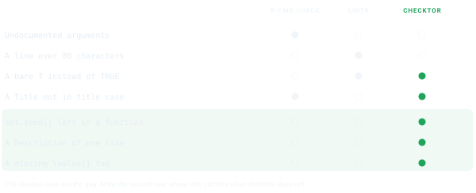
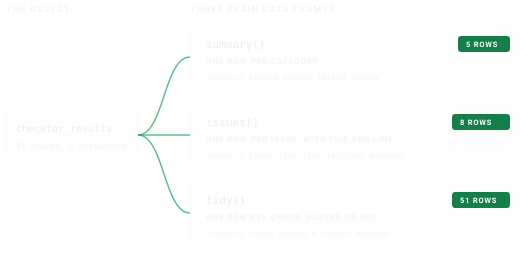

```{r}
#| label: setup
#| include: false
library(checktor)
```

<style>
.ct-fig{display:block;margin:1.5rem auto;max-width:100%;height:auto}
.ct-dark{display:none}
@media (prefers-color-scheme:dark){.ct-light{display:none}.ct-dark{display:block}}
[data-bs-theme=light] .ct-light{display:block}
[data-bs-theme=light] .ct-dark{display:none}
[data-bs-theme=dark] .ct-light{display:none}
[data-bs-theme=dark] .ct-dark{display:block}
</style>

## The gap checktor fills

`R CMD check` answers one question well, whether this package builds and runs.
The question that actually decides your submission goes unasked. Will a CRAN
volunteer, reading by hand, send it back? Those are different questions, and the
space between them is where afternoons disappear. A missing `\value{}` tag. A
`set.seed()` left inside a function. A Description that never grew past one
line. Nothing in the standard toolchain says a word about any of them.

{.ct-fig .ct-light}
{.ct-fig .ct-dark aria-hidden="true"}

`checktor` is the specialist your build refers you to before that appointment.
It runs the extra-CRAN checks that live in the Repository Policy and reviewers'
long memories but nowhere in the standard toolchain, and, true to the name, it
gives you a checkup, a diagnosis, and a prescription.

## Installation

`checktor` is on CRAN, so you can install it the usual way.

```{r eval=FALSE}
install.packages("checktor")
```

If you want the cutting-edge development version, with the latest changes before
they reach CRAN, install it from GitHub.

```{r eval=FALSE}
# install.packages("pak")
pak::pak("coatless-rpkg/checktor")
```

## A first checkup

Load the package first.

```{r}
library(checktor)
```

That brings `checktor()` and its helpers into your session, so from here
everything is a single function call, and the natural place to begin is a
checkup.

`checktor()` examines a package directory. So we can watch it work without
maiming your own package, we will point it at a throwaway package built around
one deliberately bad file.

```{r}
pkg <- example_diagnose_scenario("code_examples/tf_usage_bad.R",
                                 show_content = FALSE)
```

Here is the file it was built around, bad habits and all.

```{r}
#| label: show-bad-file
#| echo: false
#| results: asis
src <- readLines(file.path(pkg, "R", "tf_usage_bad.R"))
cat("```r\n", paste(src, collapse = "\n"), "\n```\n", sep = "")
```

> Left to itself, `example_diagnose_scenario()` prints that file for you, because
> `show_content` defaults to `TRUE`. We pass `FALSE` and render it above instead,
> so it arrives as highlighted R rather than console output.

Now the checkup itself.

```{r}
# verbose and progress are off here, which keeps the printout compact
results <- checktor(pkg, verbose = FALSE, progress = FALSE)
results
```

That bedside summary names which of the five categories (code, DESCRIPTION,
documentation, general, and CRAN policy) need attention, and gives an overall
verdict. For the full catalogue of what each category checks, see the
[function reference](https://r-pkg.thecoatlessprofessor.com/checktor/reference/index.html).

> **On your own package**, the call is simply `checktor()`. It works from anywhere
> inside the package, so calling it with your working directory in `R/` or
> `tests/testthat/` still examines the whole package.

## Reading the results as data

The printed report is for humans. When you want to *compute* on the findings,
filter them, count them, fold them into a report of your own, reach for the
accessors. They return plain data frames, so you never spelunk through nested
lists.

{.ct-fig .ct-light}
{.ct-fig .ct-dark aria-hidden="true"}

```{r}
summary(results)   # one row per category
```

```{r}
issues(results)    # one row per issue, with file and line
```

`tidy(results)` gives one row per check, passed or not, and `as.data.frame()` is
its alias. Three predicates answer the yes/no questions directly:

```{r}
is_healthy(results)
n_issues(results)
failed_checks(results)
```

Each accessor also works on a single category, as in `issues(results$code_issues)`,
or on a single check.

## The one-line gate

For scripts and pre-submission checklists, `checkup()` collapses the whole
diagnosis to a single verdict, `TRUE` when the package is clean:

```{r}
checkup(pkg)
```

Built to be the last word in a shell one-liner, it takes charge of a GitHub
Actions build in the
[checktor in Continuous Integration](checktor-in-ci.html) vignette.

## From diagnosis to treatment

A diagnosis you cannot act on is just bad news. `prescribe()` turns each finding
into a concrete remedy, with the before and after spelled out.

```{r}
prescribe(results)
```

`health_report()` writes the whole consultation to a file, as Markdown, HTML, or
plain text, to keep alongside your `cran-comments.md`:

```{r eval=FALSE}
health_report(results, file = "package-health.md")
health_report(results, file = "package-health.html", format = "html")
```

## Examining one system at a time

Each category runs on its own, which helps when you are fixing one thing and
would rather not hear about the others:

```{r eval=FALSE}
diagnose_code_issues()           # just the R sources
diagnose_description_issues()    # just DESCRIPTION
diagnose_documentation_issues()  # just the .Rd files
diagnose_general_issues()        # size, URLs
diagnose_policy_violations()     # CRAN policy
```

## Turning down the volume

`checktor()` is chatty by design. In a script, quiet it once and every later
call inherits the setting:

```{r eval=FALSE}
configure_doctor(verbose_default = FALSE, progress_default = FALSE)

# or per call
results <- checktor(verbose = FALSE, progress = FALSE)
```

## Where it fits

Run `checktor` in the gap between writing code and `R CMD check`:

```{r eval=FALSE}
devtools::document()
devtools::test()

results <- checktor()  # the extra-CRAN checkup
prescribe(results)     # apply the remedies

devtools::check()      # the standard checks
```

## Conclusion

`checktor` is a checkup, not a cure-all. It complements `R CMD check` and
[`lintr`](https://lintr.r-lib.org) rather than replacing either, and it cannot
replace your judgment about whether a package is worth submitting. What it does
do is the one thing those tools do not, remembering the hand-enforced CRAN rules
so you do not have to. Run the three together, treat the printed report as
the conversation and the accessors as the data, and a reviewer should find
nothing left to say. That is the entire point.

## See also

- [Where the Checks Come From](check-sources.html): the source and severity tier
  behind every check, from CRAN policy to convention.
- [checktor in Continuous Integration](checktor-in-ci.html): put `checkup()` in
  charge of a GitHub Actions build as a quality gate.
- [Writing Your Own Checks](writing-checks.html): add project-specific checks
  against the parsed syntax tree.
- [Function reference](https://r-pkg.thecoatlessprofessor.com/checktor/reference/index.html):
  the full catalogue of diagnostics.
