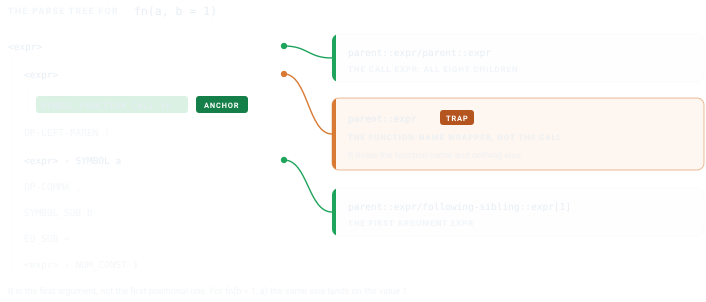

```{r}
#| label: setup
#| include: false
library(checktor)
```

<style>
.ct-fig{display:block;margin:1.5rem auto;max-width:100%;height:auto}
.ct-dark{display:none}
@media (prefers-color-scheme:dark){.ct-light{display:none}.ct-dark{display:block}}
[data-bs-theme=light] .ct-light{display:block}
[data-bs-theme=light] .ct-dark{display:none}
[data-bs-theme=dark] .ct-light{display:none}
[data-bs-theme=dark] .ct-dark{display:block}
</style>

`checktor` ships more than forty diagnostics, but every team has house rules too
local to upstream: a function you have banned, a header you insist on, a habit
you keep relapsing into. This vignette is for those. It walks through the
handful of helpers in `R/ast.R` and shows how to author a new check against the
parsed syntax tree in a few lines of XPath, with the orchestrator handling the
bookkeeping.

Every check walks the same road. Your sources are parsed once into a syntax
tree, an XPath query picks out the nodes you object to, and each match comes
back as a `file:line` string inside a result that knows how to print itself.
The figure traces that road for a check that ships in the box, the one that
flags an `options()` call whose enclosing function never puts the setting back.

{.ct-fig .ct-light}
{.ct-fig .ct-dark aria-hidden="true"}

## The shape of a check

Every diagnostic function follows the same contract:

```r
diagnose_<name> <- function(path, verbose = TRUE, parsed = NULL) {
  if (is.null(parsed)) parsed <- read_r_xml(path)
  if (length(parsed) == 0L) {
    return(checktor_check_result(TRUE, character(0), "<message>"))
  }
  # ... XPath logic ...
  checktor_check_result(passed, issues, "<message>")
}
```

> **Why the `parsed` argument?** It holds an optional parse-cache, so when
> `checktor()` runs all code-side checks together, it parses each file once and
> hands the cache to every check. Thirteen checks against a 200-file package
> then mean 200 parses rather than 2,600.

## Helpers in `R/ast.R`

`R/ast.R` holds six functions, and a check leans on them in roughly the order of
the road above. `read_r_xml()` does the parsing and `xpath_lints()` does the
querying, so between them they carry every check in the package. The rest are
shorthands for patterns common enough to have earned a name. Learn the first two
and you can already write a check.

### `read_r_xml(path)`

This is what makes your sources queryable. It parses every `R/*.R` file in the
package and returns a named list of `list(file, xml, error)`. A parse failure
becomes an `error` slot instead of crashing the run.

```r
parsed <- read_r_xml(".")
str(parsed[[1]])
#> List of 3
#>  $ file : chr "R/foo.R"
#>  $ xml  : xml_document
#>  $ error: NULL
```

The `xml` slot is an `xml2` document produced by
`xmlparsedata::xml_parse_data()`. Every parse-tree token is an XML element
with `line1`, `col1`, `line2`, `col2` attributes.

### `xpath_lints(parsed, xpath, label = NULL)`

The workhorse. Give it an XPath query, get back `"basename:line"` strings for
every match across every file, ready to hand to a check result's `$issues`.
The optional `label` appears in parens after each hit.

```r
hits <- xpath_lints(parsed,
                    "//SYMBOL_FUNCTION_CALL[text() = 'set.seed']")
#> "foo.R:42" "bar.R:17"
```

### `undesirable_function_check(parsed, funs, label = TRUE)`

The most common pattern, "flag any call to function X", has a canned
helper:

```r
issues <- undesirable_function_check(parsed,
                                     c("install.packages", "browser"))
```

This is `checktor`'s equivalent of `lintr::undesirable_function_linter()`.

### `not_under_fn_with_call_xpath(funs)`

Returns an XPath predicate that restricts hits to nodes whose *innermost*
enclosing function-body doesn't also contain a call to any of `funs`. This
is how `option_changes` enforces that `options()` is guarded by a sibling
`on.exit()` in the same function, and the "innermost" part is what makes
it correct on nested functions where `on.exit` in the outer function
wouldn't cover an inner one.

```r
predicate <- not_under_fn_with_call_xpath(c("on.exit", "local_options"))
xpath <- paste0(
  "//SYMBOL_FUNCTION_CALL[text() = 'options']",
  "[", predicate, "]"
)
```

### `extract_rd_section(rd, tag)` and `collect_rd_text(node, skip)`

Walking `.Rd` files structurally via `tools::parse_Rd()`:

```r
rd <- tools::parse_Rd("man/my_fn.Rd")
ex <- extract_rd_section(rd, "\\examples")
collect_rd_text(ex, skip = "\\dontrun")
```

## Walked example: `Sys.setenv()` without cleanup

Suppose we want a check that flags any `Sys.setenv()` call whose enclosing
function doesn't also call `on.exit(Sys.unsetenv(...))` or
`withr::local_envvar()`. This is the same shape as `diagnose_option_changes`
and ships in checktor as `diagnose_sys_setenv_no_reset`. Here is the
essential shape:

```r
diagnose_sys_setenv_no_reset <- function(path, verbose = TRUE,
                                         parsed = NULL) {
  # reuse the parse-cache when checktor() supplies one, else parse fresh
  if (is.null(parsed)) parsed <- read_r_xml(path)
  if (length(parsed) == 0L) {
    return(checktor_check_result(TRUE, character(0),
                                 "Sys.setenv reset check"))
  }
  xpath <- paste0(
    "//SYMBOL_FUNCTION_CALL[text() = 'Sys.setenv'][",
    # keep only calls whose enclosing function never resets the variable
    "  ", not_under_fn_with_call_xpath(c(
        "on.exit",
        "Sys.unsetenv",
        "local_envvar", "with_envvar"
      )),
    "]"
  )
  issues <- xpath_lints(parsed, xpath)
  passed <- length(issues) == 0L
  # a shipped check also calls emit_issue_summary(issues, verbose, ...) here
  # to print the cli summary when verbose = TRUE
  checktor_check_result(passed, issues, "Sys.setenv reset check")
}
```

Twenty lines, and the interesting one is the XPath predicate. Everything else
is bookkeeping shared with every other check.

## The xmlparsedata XML structure

A call `fn(a, b = 1)` parses to:

```xml
<expr>                              <!-- call expr -->
  <expr>                            <!-- function-name expr -->
    <SYMBOL_FUNCTION_CALL>fn</SYMBOL_FUNCTION_CALL>
  </expr>
  <OP-LEFT-PAREN>(
  <expr><SYMBOL>a</SYMBOL></expr>   <!-- first positional arg -->
  <OP-COMMA>,
  <SYMBOL_SUB>b</SYMBOL_SUB>        <!-- named-arg name -->
  <EQ_SUB>=</EQ_SUB>
  <expr><NUM_CONST>1</NUM_CONST></expr>  <!-- named-arg value -->
  <OP-RIGHT-PAREN>)
</expr>
```

Anchor on the `SYMBOL_FUNCTION_CALL` and every other node is one axis away. The
amber card is the one that catches people out.

![The parse tree for `fn(a, b = 1)`. Anchored on the `SYMBOL_FUNCTION_CALL` node, `parent::expr` reaches only the function-name wrapper, which is the trap. The call expr is `parent::expr/parent::expr`, and the first positional argument is `parent::expr/following-sibling::expr[1]`.](figures/xpath-axes-light.svg){.ct-fig .ct-light}
{.ct-fig .ct-dark aria-hidden="true"}

- the call expr is `parent::expr/parent::expr`
- the first argument expr is `parent::expr/following-sibling::expr[1]`
- a named-arg name is `parent::expr/parent::expr/SYMBOL_SUB`

That middle one is the first *argument*, not the first *positional* argument.
For `fn(b = 1, a)` the same axis lands on the value `1`, so reach for it only
when you already know the shape of the call.

## Trying it out

```r
# Parse a file
parsed <- read_r_xml("path/to/package")

# Find every call to install.packages()
xpath_lints(parsed,
            "//SYMBOL_FUNCTION_CALL[text() = 'install.packages']")
```

To plug a new check into `checktor()`, add a `diagnose_<name>` function to the
appropriate `R/diagnostics-*.R` file and register it in that file's
`run_checks(list(...), path, verbose)` call as a closure that forwards the
cache: `my_check = function(p, v) diagnose_my_check(p, v, parsed = parsed)`.
That closure is what lets your check share the parse-once cache, while the
orchestrator handles error catching and `$passed` bookkeeping for you.

## Conclusion

Building on the parsed syntax tree buys the property that makes `checktor`
trustworthy, because a pattern sitting in a string literal or a comment is a
different kind of node than a real call, so it never false-positives.

{.ct-fig .ct-light}
{.ct-fig .ct-dark aria-hidden="true"}

Write the XPath, let `run_checks()` carry the rest, and your house rule is
enforced as rigorously as the checks that ship in the box.

## See also

- [Getting Started with checktor](getting-started-with-checktor.html):
  end-to-end usage from a user's perspective.
- [checktor in Continuous Integration](checktor-in-ci.html): run `checkup()`
  as a build gate.
- `?xmlparsedata::xml_parse_data` and
  [the lintr docs on writing linters](https://lintr.r-lib.org/articles/creating_linters.html)
  for the same patterns at a larger scale.
